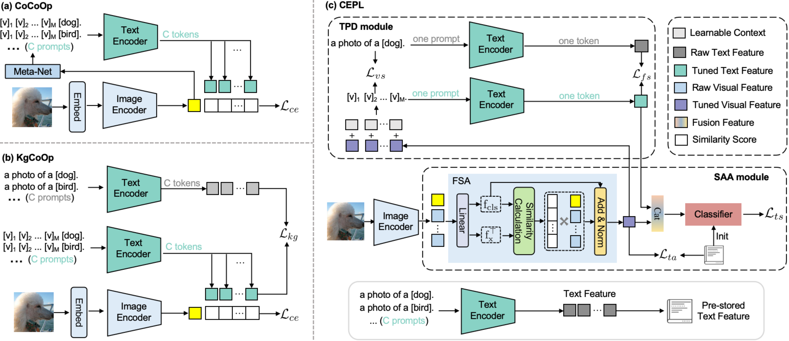
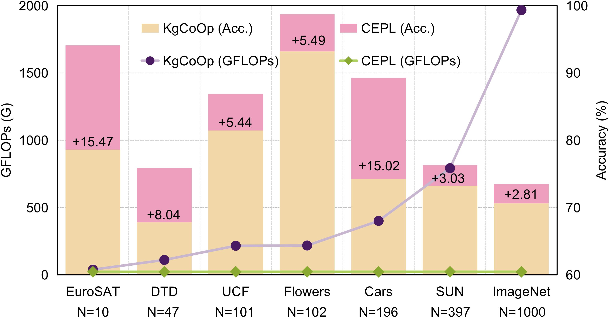

# Decoupling and Aligning: A New Paradigm for Computationally Efficient Prompt Learning


## Highlights

>*Prompt learning, as a parameter-efficient fine-tuning paradigm, has emerged as a trend in adapting large pre-trained vision-language models (VLMs) to downstream tasks. However, most existing methods, like CoCoOp and KgCoOp, require converting category names from specific tasks into textual descriptions as text prompt inputs, resulting in the computational cost of the text encoder increasing in direct proportion to the number of categories in the downstream task. To address this challenge, we propose a novel Computationally Efficient Prompt Learning (CEPL) method, which showcases remarkable performance improvement while significantly reducing computation cost. Our CEPL involves the following two key points. 1) Boosted computation efficiency. We propose a textual prompt decoupling module (TPD) that decouples category names from text prompts by learning an image-conditioned text prompt, rather than directly embedding the complete category names. 2) Enhanced tuning effectiveness. We introduce a semantic alignment adaptation module (SAA) which fine-tunes original image features by optimizing task-specific and task-agnostic losses, so that image features are not only aligned with semantic-level text but also adaptable to downstream tasks. Extensive experiments demonstrate that our CEPL achieves superior classification performance at extremely low computational overhead. In particular, CEPL reduces GFLOPs by 95% compared to the state-of-the-art KgCoOp, and yields an average accuracy improvement of 7.57% across 16-shot classifications in 11 datasets.*

<br>


## Main Contributions
We present Computationally Efficient Prompt Learning (CEPL), a novel approach that not only achieves remarkable improvements in performance across various tasks but also significantly reduces computational costs.  This dual focus on efficiency and effectiveness makes CEPL a compelling solution for adapting large vision-language models to diverse downstream applications.

<div style="text-align: center;">
    
</div>

<!--  -->

<br>


## Model Zoo
16-shot Classification Task On the 11 datasets

| Dataset      | CEPL Acc. | Log/CEPL                                   | 
| ------------ | ----------- |  ------------------------------------- | 
| ImageNet     | 73.47       | [Link](CEPL_logs/imagenet)     | 
| Caltech101   | 97.04       | [Link](CEPL_logs/caltech101)   |
| OxfordPets   | 93.81       | [Link](CEPL_logs/oxford_pets)         | 
| StanfordCars |  89.27       | [Link](CEPL_logs/stanford_cars)     | 
| Flowers102   |  98.71       | [Link](CEPL_logs/oxford_flowers)    | 
| Food101      |  86.61       | [Link](CEPL_logs/food101)      | 
| FGVCAircraft | 62.38       | [Link](CEPL_logs/fgvc_aircraft)  | 
| SUN397       |  76.25       | [Link](CEPL_logs/sun397)       | 
| DTD            | 75.85       | [Link](CEPL_logs/dtd)          | 
| EuroSAT      | 94.08       | [Link](CEPL_logs/eurosat)      | 
| UCF101       | 86.90       | [Link](CEPL_logs/ucf101)          |
| Average      | 84.94       |                                        |

<br>


## How to Install

This code is built on top of the awesome toolbox [Dassl.pytorch](https://github.com/KaiyangZhou/Dassl.pytorch) so you need to install the `dassl` environment first. Simply follow the instructions described [here](https://github.com/KaiyangZhou/Dassl.pytorch#installation) to install `dassl` as well as PyTorch. After that, run `pip install -r requirements.txt` under `CEPL_Code/` to install a few more packages required by [CLIP](https://github.com/openai/CLIP) (this should be done when `dassl` is activated). You are now ready to begin.

<br>

## How to Run

### Few-Shot Learning

This section corresponds to the experiments described in Section 3.1, Few-shot classification.

#### Step 1: Generate Text Features:
Configure `CEPL_Code/exp/cross_modal_engine/config/default.py` to specify the paths for text features and the dataset. Then, run `CEPL_Code/get_text_feature.sh` to generate and save the text features. Update the text feature path in `CEPL_Code/get_linear_head_weight.py` with the generated text feature path.

#### Step 2: Train the Model:
You will need `CEPL_Code/bash.sh` . The bash train and evaluate the model on all classes. Both scripts have three input arguments, i.e., `DATASET`, `EPOCH` and `SEED`.
`DATASET` takes as input a dataset name, like `imagenet` or `caltech101`. The valid names are the files names in `CEPL_Code/configs/datasets/`.

Use `CEPL_Code/bash.sh` to train and evaluate the model on all classes. The script accepts three input arguments: `DATASET`, `EPOCH` and `SEED`.
+ `DATASET`: Name of the dataset (e.g., `imagenet`, `caltech101`). Valid names are listed in `CEPL_Code/configs/datasets/`.

#### Example: Evaluate the Model on Stanford_Cars

```bash
# seed=1
bash scripts/efficient_prompts/xd_train.sh  stanford_cars 50 1 
bash scripts/efficient_prompts/xd_test.sh  stanford_cars 50 1 
```

#### Output Structure
After executing the above commands, the output will be organized as follows:
```
output
|–– CEPL/
|   |–– stanford_cars/
|   |   |–– vit_b16_cepl_16shots/
|   |   |   |–– seed1/
output
|–– evaluation/
|   |–– stanford_cars/
|   |   |–– vit_b16_cepl_16shots/
|   |   |   |–– seed1/
```

<br>


# License

This repository is released under the Apache 2.0 license as found in the [LICENSE](LICENSE) file.

<br>

# Acknowledgement
We would like to thank the authors of  [KgCoOp]( https://github.com/htyao89/KgCoOp) and [CoOp](https://github.com/KaiyangZhou/CoOp), based on which this codebase was built.
